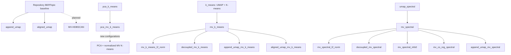

# Pairwise comparisons: proposed trees and controls

Part of the [pairwise comparison proposal](pairwise_comparisons.md). These are proposed comparisons, not claims of observed improvement or verified strict ablations.

## Starting branches

The user's requested branches are:

1. Default BERTopic → MV-HDBSCAN, being implemented separately by the user.
2. PCA + K-means → PCA + MV K-means.
3. UMAP + spectral clustering → UMAP + MV spectral clustering.

Add comparisons from Default BERTopic to AppendUMAP and AlignedUMAP. Until its meaning is settled, use **repository BERTopic baseline** for the existing `baseline` configuration. See [configuration findings](pairwise_repository_findings.md).

## Proposed graph

The following uses existing model IDs where available. Dashed arrows indicate planned implementation/configuration work. Solid arrows still require coverage and parity checks.

The graph is a display of selected edges, not a multiplicity-family definition. Multiple parents and branches are allowed; there is no requirement to force every variant into one ladder.

## Interpretation of edges

| Edge | Scientific question/intervention | Initial classification |
| --- | --- | --- |
| `baseline → append_umap` | Add metadata before UMAP while retaining HDBSCAN and topic-reduction policy | Strict-ablation candidate |
| `baseline → aligned_umap` | Replace ordinary UMAP with jointly aligned views | Architectural comparison |
| `baseline → MV-HDBSCAN` | Introduce the forthcoming clustering method | Planned; classification pending implementation |
| `pca_k_means → pca_mv_k_means` | Introduce multi-view clustering after PCA | Architectural with current defaults |
| `k_means → mv_k_means` | Introduce multi-view clustering after UMAP | Architectural with current defaults |
| `umap_spectral → mv_spectral` | Introduce multi-view spectral clustering | Architectural with current affinities |
| MV model → matching `_l2_norm` variant | Normalize only the reduced text view | Strict-ablation candidate after mutation issue is resolved |
| `mv_spectral → mv_spectral_info0` | Change final embedding selection while retaining multi-view learning | Strict-ablation candidate |
| `mv_spectral → mv_co_reg_spectral` | Change the multi-view spectral formulation | Architectural comparison |
| MV model → decoupled model | Change modality-specific geometry and potentially implementation behavior | Architectural until equivalence controls are checked |
| `mv_k_means → append_umap_mv_k_means` | Add metadata during reduction when clustering already uses metadata | Strict-ablation candidate |
| `mv_k_means → aligned_umap_mv_k_means` | Replace reduction with aligned multi-view reduction | Architectural comparison |
| `mv_spectral → append_umap_mv_spectral` | Add metadata during reduction when spectral clustering already uses metadata | Strict-ablation candidate |

Also register the corresponding co-regularized `info0` contrast. Spherical MV K-means, STM, and TriTopic/FastTriTopic initially fit best as secondary architectural benchmarks.

“Strict-ablation candidate” is not approval to call an edge strict in the paper. The configuration and historical-run audit must verify it first. Metadata can enter both reduction and clustering in combined variants; descriptions must make that explicit.

## Deeper geometry branches

For clean geometry questions, compare configurations within the **same implementation**:

- Decoupled K-means: `[euclidean, euclidean] → [cosine, euclidean]`.
- Decoupled spectral: `[rbf, rbf] → [cosine, rbf]`.

Keep initialization, iteration limits, modality weights, dimensionality reduction, output-view selection, and unrelated settings fixed. These are cleaner than claiming a transition from a normalized existing estimator to a different decoupled estimator changes only one distance function.

The PCA branch can be extended with normalization and decoupled configurations, but active versions of those configurations are currently missing. Existing Yelp normalization/decoupled configurations use UMAP.

Do not describe `info_view=0` as metadata removal: multi-view fitting has already used metadata. Do not describe spherical MV K-means as text-only normalization: both views are normalized.

## Missing controls and experiments

| Addition | Purpose |
| --- | --- |
| Explicitly aligned initialization settings for single-view and MV K-means | Remove the current `n_init` mismatch |
| Text-only spectral control with the final CAST affinity/bandwidth and downstream spectral conventions | Separate metadata incorporation from graph-construction changes |
| Same-implementation metadata-off controls where feasible | Isolate metadata contribution without replacing the whole estimator |
| PCA normalization and decoupled configurations, run across all five datasets | Extend the PCA branch beyond its current architecture comparison |
| Euclidean/Euclidean and RBF/RBF decoupled controls | Isolate geometry changes within one implementation |
| Missing full-size spectral and AlignedUMAP cells | Complete the prespecified five-dataset grids |
| Audited or rerun normalized results after correcting configuration mutation | Establish that named interventions actually occurred |
| MV-HDBSCAN node and parity specification | Integrate the user's new method when available |

For metadata-off controls, initialization must also be independent of metadata. Setting metadata weight to zero is insufficient if metadata still influences initialization or other computation.

A stock-BERTopic baseline is optional if the existing baseline is accurately named. Which architectures count as the **final CAST variants** remains an open decision and determines which metadata-off controls should receive priority.

See [observed coverage](pairwise_repository_findings.md) before assuming these edges can already support cross-dataset inference.
